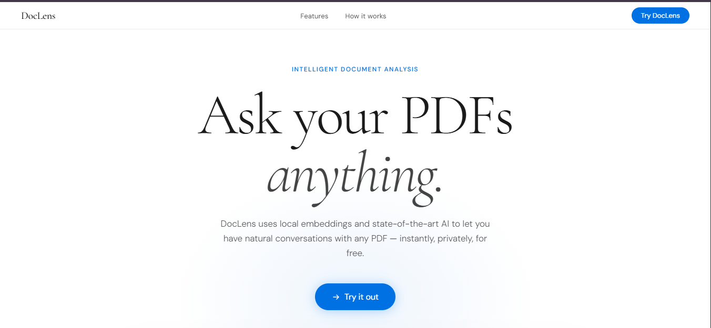
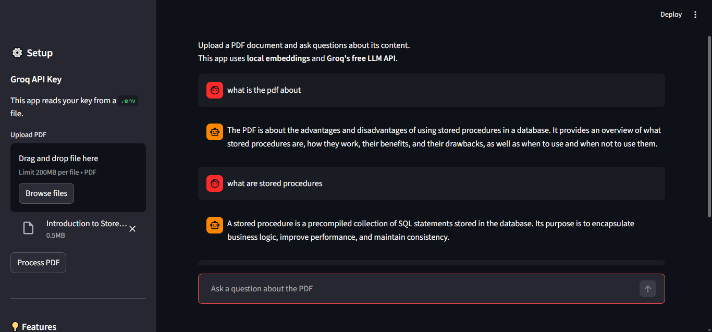

# 📚 PDF Q&A Assistant - Intelligent Document Query System

<div align="center">


*An intelligent RAG (Retrieval-Augmented Generation) application that enables natural language querying of PDF documents*

[Features](#-features) • [Demo](https://pdf-rag-a1.streamlit.app/) • [Installation](#-installation) • [Usage](#-usage) • [Architecture](#-architecture) • [Contributing](#-contributing)

</div>

---

## 🎯 Overview

PDF Q&A Assistant is a production-ready application that leverages state-of-the-art RAG technology to enable intelligent question-answering over PDF documents. Built with privacy and performance in mind, it uses **local embeddings** and **free cloud-based LLMs** to deliver fast, accurate responses.

### 🌟 Key Highlights

- **🔒 Privacy-First**: Embeddings generated locally - your documents never leave your machine for vectorization
- **💰 Cost-Effective**: Uses Groq's free API with generous rate limits
- **⚡ High Performance**: Fast inference with Llama 3.1 70B model
- **🎨 Modern UI**: Clean, intuitive Streamlit interface with chat functionality
- **📊 Production-Ready**: Error handling, session management, and optimized chunking

---

## ✨ Features

### Core Functionality
- 📄 **PDF Text Extraction**: Robust PDF parsing with pypdf
- 🔍 **Semantic Search**: FAISS vector store for efficient similarity search
- 💬 **Conversational Interface**: Maintains chat history for context-aware responses
- 🧠 **Smart Chunking**: Optimized text splitting with overlap for context preservation

### Technical Features
- **Local Embeddings**: HuggingFace `sentence-transformers/all-MiniLM-L6-v2`
- **Advanced LLM**: Groq's Llama 3.1-8b Instant model
- **Vector Database**: FAISS for high-performance retrieval
- **Retrieval Strategy**: Top-k similarity search (k=3)
- **Chunk Configuration**: 1000 chars with 200 char overlap

---

## 🚀 Demo
 
 App is live here: https://pdf-rag-a1.streamlit.app/

 ## Screenshots

### Application Flow


```
1. Upload PDF → 2. Process Document → 3. Ask Questions → 4. Get Answers
     📄              🔄                    💭               ✅
```

### Sample Interaction

**User**: "What are the main conclusions of this research paper?"

**Assistant**: *Analyzes the PDF and provides a concise, context-aware summary based on the document content*

---

## 📦 Installation

### Prerequisites

- Python 3.8 or higher
- pip package manager
- 2GB+ RAM recommended

### Quick Start

1. **Clone the repository**
```bash
git clone https://github.com/dev-k99/RAG-Assistant
cd pdf-rag-app
```

2. **Create virtual environment** (recommended)
```bash
python -m venv venv 
On Windows: venv\Scripts\activate
```

3. **Install dependencies**
```bash
pip install -r requirements.txt
```

4. **Get your free Groq API key**
   - Visit [console.groq.com](https://console.groq.com)
   - Sign up for a free account
   - Generate an API key (takes 30 seconds)

5. **Run the application**
```bash
streamlit run app.py
```

The app will open in your browser at `http://localhost:8501`

---

## 💻 Usage

### Basic Workflow

1. **Enter API Key**: Paste your Groq API key in the sidebar
2. **Upload PDF**: Select a PDF file from your computer
3. **Process**: Click "Process PDF" to create embeddings
4. **Query**: Ask questions in the chat interface

### Example Questions

- "Summarize the key findings of this document"
- "What methodology was used in section 3?"
- "List all the recommendations mentioned"
- "Explain the concept of [specific term] as described in the PDF"

### Tips for Best Results

✅ **Do**:
- Ask specific questions
- Reference sections or topics in your questions
- Break complex queries into multiple questions

❌ **Avoid**:
- Questions outside the document scope
- Asking for information not in the PDF
- Extremely vague or ambiguous queries

---

## 🏗️ Architecture

### System Architecture

```
┌─────────────────┐
│   Streamlit UI  │
└────────┬────────┘
         │
         ▼
┌─────────────────┐
│  PDF Extractor  │
└────────┬────────┘
         │
         ▼
┌─────────────────┐
│ Text Splitter   │ ← RecursiveCharacterTextSplitter
└────────┬────────┘
         │
         ▼
┌─────────────────┐
│  HF Embeddings  │ ← sentence-transformers/all-MiniLM-L6-v2
└────────┬────────┘
         │
         ▼
┌─────────────────┐
│  FAISS Vector   │
│     Store       │
└────────┬────────┘
         │
         ▼
┌─────────────────┐
│   Retriever     │ ← Top-k similarity search
└────────┬────────┘
         │
         ▼
┌─────────────────┐
│   Groq LLM      │ ← Llama 3.1 70B
└────────┬────────┘
         │
         ▼
┌─────────────────┐
│    Response     │
└─────────────────┘
```

### Technology Stack

| Component | Technology | Purpose |
|-----------|-----------|---------|
| **Frontend** | Streamlit | Web interface & chat UI |
| **LLM** | Groq (Llama 3.1 70B) | Response generation |
| **Embeddings** | HuggingFace Transformers | Local vector embeddings |
| **Vector DB** | FAISS | Similarity search |
| **Orchestration** | LangChain | RAG pipeline |
| **PDF Parser** | pypdf | Text extraction |

---

## 📁 Project Structure

```
pdf-rag-app/
│
├── app.py                  # Main Streamlit application
├── requirements.txt        # Python dependencies
├── README.md              # This file
│
└── (generated at runtime)
    ├── .streamlit/        # Streamlit config (optional)
    └── models/            # Cached HuggingFace models
```

---

## 🔧 Configuration

### Customization Options

Edit `app.py` to customize:

```python
# Chunk size and overlap
chunk_size=1000,      # Characters per chunk
chunk_overlap=200,    # Overlap between chunks

# Retrieval settings
search_kwargs={"k": 3}  # Number of chunks to retrieve

# LLM settings
temperature=0.3,      # Response creativity (0-1)
model="llama-3.1-8b-instant"  # Groq model
```

### Alternative Models

**Embeddings** (local):
- `sentence-transformers/all-mpnet-base-v2` (higher quality)
- `sentence-transformers/paraphrase-MiniLM-L6-v2` (faster)

**LLMs** (Groq):
- `llama-3.1-8b-instant` (faster, lighter)
- `mixtral-8x7b-32768` (alternative option)

---

## 🚀 Deployment

### Streamlit Cloud (Recommended)

1. Push code to GitHub
2. Visit [streamlit.io/cloud](https://streamlit.io/cloud)
3. Connect your repository
4. Add `GROQ_API_KEY` to secrets
5. Deploy!


## 📊 Performance

### Metrics

| Metric | Value |
|--------|-------|
| Embedding Speed | ~2-3 seconds for 100-page PDF |
| Query Response Time | ~1-2 seconds |
| Memory Usage | ~500MB - 1GB |
| Supported PDF Size | Up to 50MB |

### Optimizations

- ✅ Cached embeddings model (loads once)
- ✅ Efficient FAISS indexing
- ✅ Optimized chunking strategy
- ✅ Session state management

---

## 🛠️ Troubleshooting

### Common Issues

**Problem**: "Could not extract text from PDF"
- **Solution**: Ensure PDF is text-based, not scanned images. For scanned PDFs, use OCR tools first.

**Problem**: Slow first-time processing
- **Solution**: First run downloads the embedding model (~90MB). Subsequent runs are faster.

**Problem**: "Error generating response"
- **Solution**: Check your Groq API key is valid and has remaining quota.

**Problem**: Out of memory errors
- **Solution**: Reduce chunk_size or process smaller PDFs.

---

## 🤝 Contributing

Contributions are welcome! Here's how you can help:

1. 🍴 Fork the repository
2. 🌿 Create a feature branch (`git checkout -b feature/AmazingFeature`)
3. 💾 Commit your changes (`git commit -m 'Add some AmazingFeature'`)
4. 📤 Push to the branch (`git push origin feature/AmazingFeature`)
5. 🎉 Open a Pull Request

### Development Setup

```bash
# Clone your fork
git clone https://github.com/dev-k99/RAG-Assistant

# Install dev dependencies
pip install -r requirements.txt
pip install black pytest  # Code formatting and testing

# Run tests
pytest tests/

# Format code
black app.py
```

---

## 📈 Roadmap

- [ ] Multi-document support
- [ ] Document upload history
- [ ] Export chat conversations
- [ ] Support for other file formats (DOCX, TXT)
- [ ] Custom prompt templates
- [ ] OCR support for scanned PDFs
- [ ] Multiple language support
- [ ] API endpoint for programmatic access

---

## 📝 License

This project is licensed under the MIT License - see the [LICENSE](LICENSE) file for details.

---

## 🙏 Acknowledgments


- [LangChain](https://www.langchain.com/) for the RAG framework
- [Groq](https://groq.com/) for free, fast LLM inference
- [HuggingFace](https://huggingface.co/) for embedding models
- [Streamlit](https://streamlit.io/) for the amazing UI framework

---

## 📧 Contact

**Kwanele** - [@just_know6](https://twitter.com/@just_know6) - kwanelerh069@gmail.com

Project Link: [https://github.com/dev-k99/RAG-Assistant](https://github.com/dev-k99/RAG-Assistant)

---

<div align="center">

### ⭐ Star this repo if you find it useful!

Made with ❤️ and ☕

</div>